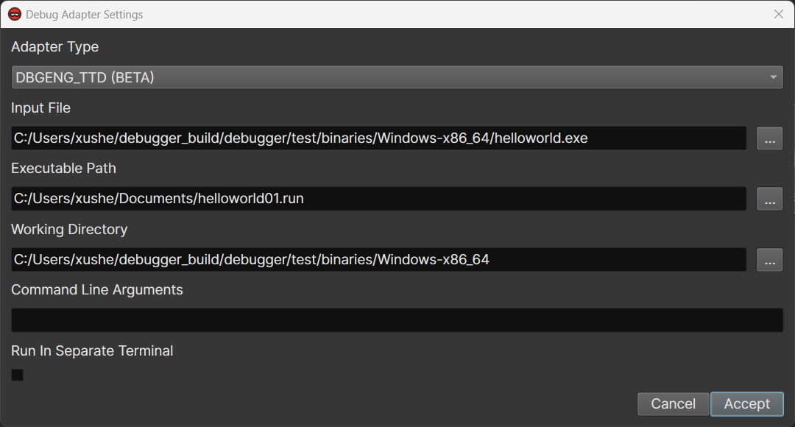

# Time Travel Debugging (beta)

Time travel debugging (TTD) allows you to record an execution trace of a program or system and replay it back and forth.
It can speed up the process of reverse engineering/vulnerability research, and deal with certain tasks that are not easy to handle in regular forward debugging.

Several tools implement TTD. As of now, Binary Ninja debugger integrates with the WinDbg/DbgEng TTD so that you can replay and analyze a trace recorded by WinDbg.
The combination of TTD and your familiar reverse engineer tool would hopefully supercharge the ability to time travel and make your workflow even more effective.

Below is a guide to set it up.

## Install WinDbg

- Navigate to https://learn.microsoft.com/en-us/windows-hardware/drivers/debugger/
- Click the `Download WinDbg` button
- Run the downloaded `windbg.appinstaller` and proceed with the installation
  - In case the downloaded installer does not work, open it in a text editor and find the download link that looks like `https://windbg.download.prss.microsoft.com/dbazure/prod/1-2306-12001-0/windbg.msixbundle`
  - Open the link in the browser, download the full installer, and install it

## Update Binary Ninja to the Development Build

If you are running the stable version of Binary Ninja or a development build earlier than `3.5.4334`, you will need to update Binary Ninja to a newer version.

- Click `Edit` -> `Preferences` -> `Update Channel...`
- For `Update channel`, select `Binary Ninja development build`
- For `Select version`, select the newest one with the largest build number

## Set up WinDbg For Binary Ninja Debugger

Due to some permission issue, Binary Ninja cannot load the DLLs from the WinDbg installation folder, which is inside `C:\Program Files\WindowsApps`.
So you will need to copy the entire WinDbg installation folder to a place that Binary Ninja can properly access.

- Create a new folder in your home directory, e.g., `C:\Users\user_name\windbgx`
- Find out the installation path of WinDbg
  - Launch WinDbg
  - Open Task Manager, go to `Details` tab, find `DbgX.Shell.exe`
  - Right-click it, and then click `Open File location`
  - The explorer should open up a path like `C:\Program Files\WindowsApps\Microsoft.WinDbg_1.2306.12001.0_x64__8wekyb3d8bbwe`
- Copy everything in the WinDbg installation folder into the new folder you created earlier
  - Simply select everything and press `Ctrl+C`, since you cannot navigate to its parent folder `C:\Program Files\WindowsApps`
- Open Binary Ninja and click `Edit` -> `Preferences` -> `Settings`
- Search for the setting `debugger.x64dbgEngPath`
- Put path `C:\Users\user_name\windbgx\amd64` in it
  - Do not forget to append `amd64` to the path of the folder
- There is a plan to automate this process: https://github.com/Vector35/debugger/issues/486

## Record a TTD Trace

- Open WinDbg
- Click `File` -> `Start debuggin` -> `Launch Executable (advanced)`
- Select the executable file you wish to record
- Check `Record with Time Travel Debugging`, and click `Debug`
- In the popup dialog, select a folder to save the recorded trace
- Wait for the process to exit, or click `Stop and Debug` when appropriate
- WinDbg then loads the trace and indexes it
  - The index will make it faster to work with the trace
- Close WinDbg
- Or check out the official guide at https://learn.microsoft.com/en-us/windows-hardware/drivers/debugger/time-travel-debugging-record
- There is a plan to automate this process: https://github.com/Vector35/debugger/issues/485

## Configure the TTD Trace in Binary Ninja Debugger

- Open the .exe or .dll file in Binary Ninja
- Click `Debugger` -> `Debug Adapter Settings`
- For `Adapter Type`, select `DBGENG_TTD (BETA)`
- For `Executable Path`, select the trace file recorded by WinDbg in the previous step
  - E.g., `C:/Users/xushe/Documents/helloworld01.run`
- Click `Accept`

## Work with the TTD Trace

- Click `Launch` to launch the target
- Most of the debugger functionalities should work in the very same way as a forward debugging
- To make the target run forward, you can either use the buttons in the debugger sidebar, or use the following commands in the debugger console:
  - [g](https://learn.microsoft.com/en-us/windows-hardware/drivers/debugger/g--go-): go
  - [p](https://learn.microsoft.com/en-us/windows-hardware/drivers/debugger/p--step-): step over
  - [t](https://learn.microsoft.com/en-us/windows-hardware/drivers/debugger/t--trace-): step into
  - [gu](https://learn.microsoft.com/en-us/windows-hardware/drivers/debugger/gu--go-up-): step out
- To make the target run backward, you will need to use one of these [commands](https://learn.microsoft.com/en-us/windows-hardware/drivers/debugger/time-travel-debugging-navigation-commands):
  - g-: go back
  - p-: step over back
  - t-: step into back
  - g-u: step out back
  - There is a plan to add several new buttons that do reverse execution: https://github.com/Vector35/debugger/issues/484
- The [!position](https://learn.microsoft.com/en-us/windows-hardware/drivers/debugger/time-travel-debugging-extension-positions) command prints the `position` of all active threads
- The [!tt](https://learn.microsoft.com/en-us/windows-hardware/drivers/debugger/time-travel-debugging-extension-tt) command navigates to a `position` in the trace
  - E.g., `!tt 1A0:12F`
  - While using the debugger, when the target stops, the current position will be printed in the debugger console

## Feedback and Suggestions

The TTD integration in Binary Ninja debugger is still in the beta stage so it will likely contain some bugs or lack certain features.
The good news is the debugger is [open-source](https://github.com/Vector35/debugger) and we have a public issue repository for it: https://github.com/Vector35/debugger/issues/.
Please feel free to file bug reports, and request new features, either specifically for the TTD or more generally for the debugger. Or even better, join our public [Slack](https://slack.binary.ninja/) and talk to the developers and users!